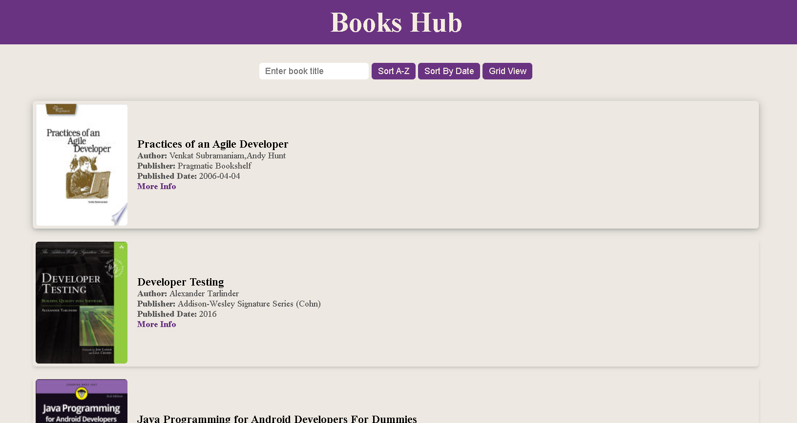
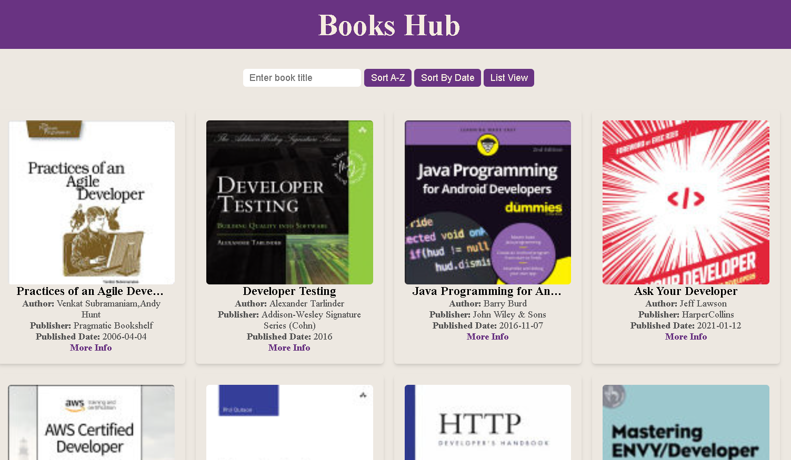

# Book Listing App

A simple web application for listing and filtering books.

# Features

* It fetchs books from the API and displays them as a list or grid.

* It shows book details including title, author, publisher, published date, and thumbnail.

* There is a search bar to filter books by book title.

* There is also a sorting feature to arrange books in alphabetical order.

* By clicking on 'more info' , user will get more details about the book.

# Screenshots

 List View

 
 
 

Grid View

# Live Link
Get a live demo **[here](https://book-library-nyr3vwuim-tapomoys-projects.vercel.app/)**.

# Languages Used
* HTML
* CSS
* JAVASCRIPT