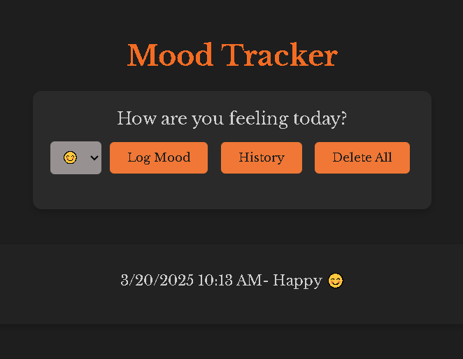

# Mood Tracker

 A simple web application to log mood on emoji basis. It logs history in the local storage with date and timestamp. History can be deleted any time using delete button.

 # Features

 *  Logs mood based on emojis.

 *  Store logs into local storage of browser.

 *  Shows log history when required.

 *  Deletes history if needed.

 # How to use
 
 * Select emoji from dropdown menu as per your mood.

 * click Log Mood button for storing your mood with date and timestamp.

 * If page got refreshed hit the History button to see past logs.

 * Use delete button to delete all logs.

 # screenshot
    

 
 
 #  Languages Used

 *  HTML
 *  CSS
 *  JAVASCRIPT

# Live Demo

You can try it out [here](https://moodtracker-three.vercel.app/).
